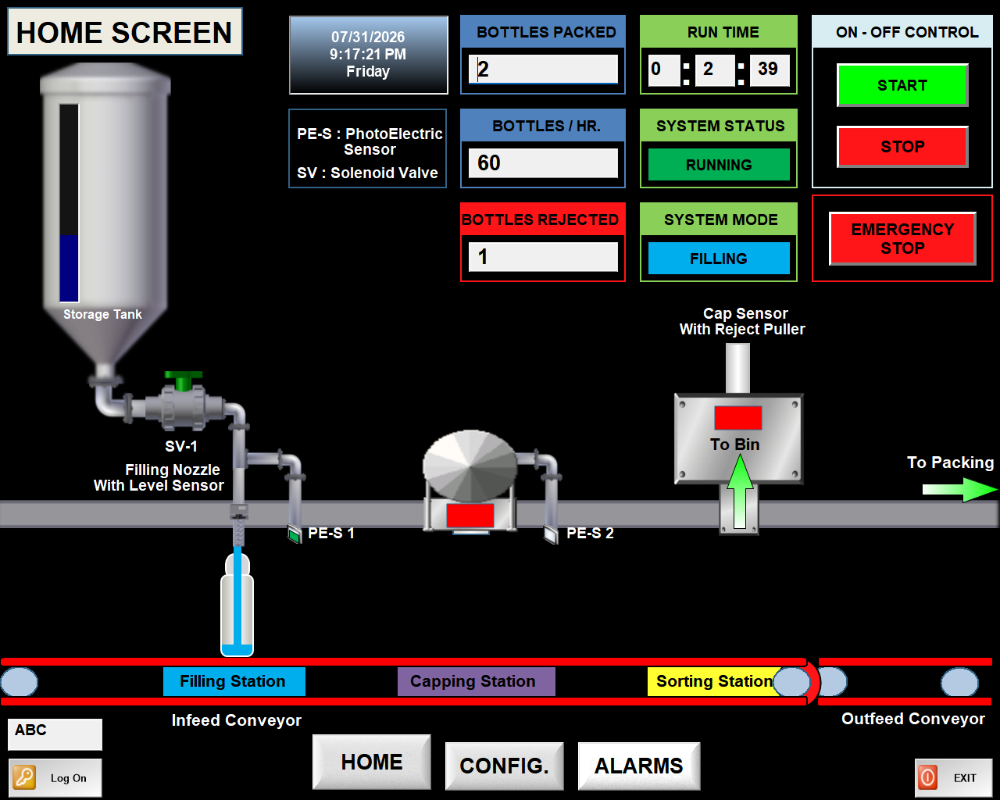
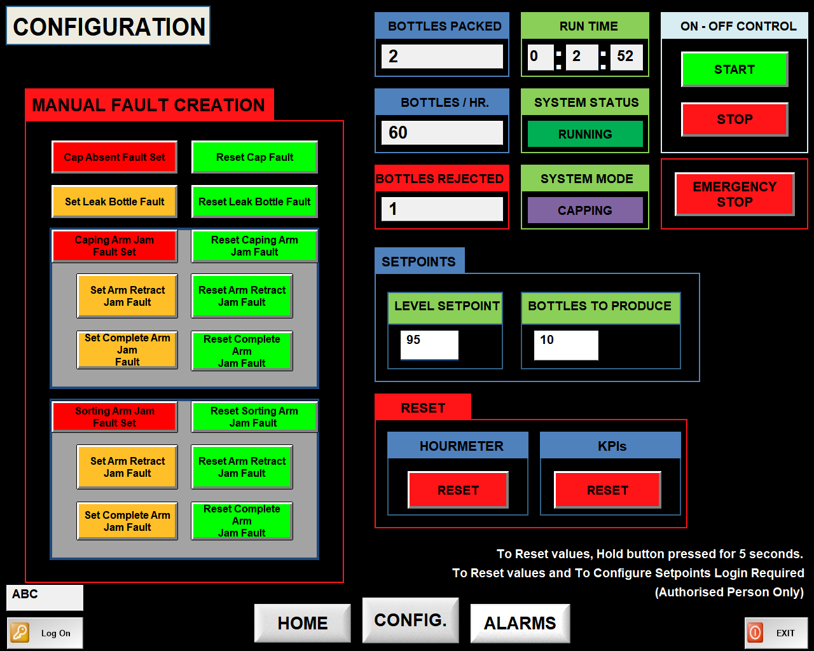
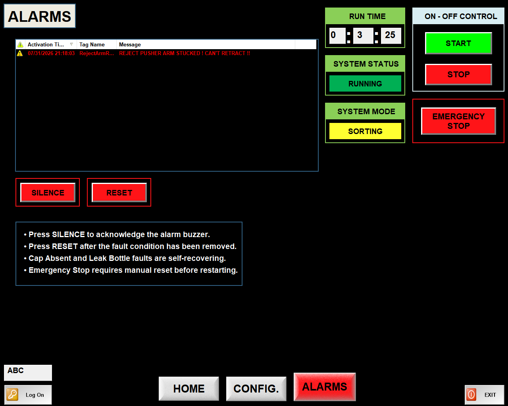
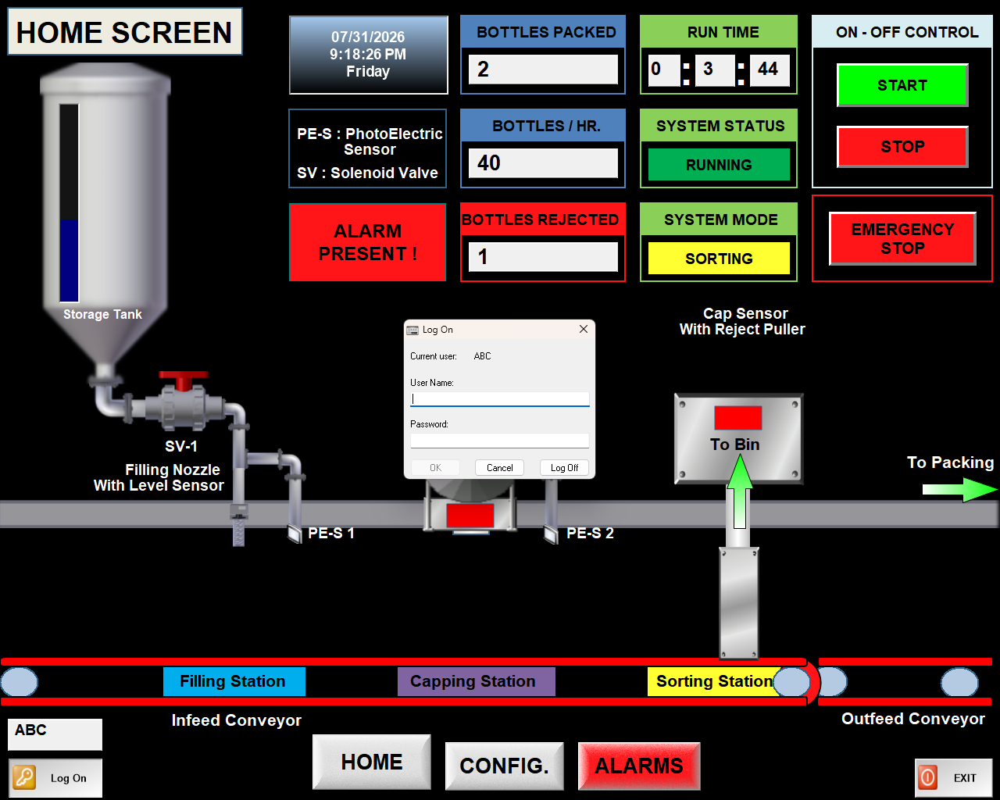

# 🏭 Industrial Bottle Packaging Line

### Industrial Automation using Allen-Bradley MicroLogix 1100 PLC and Wonderware InduSoft Web Studio (AVEVA Edge)

> A complete industrial bottle packaging line simulation featuring automated bottle filling, capping, quality verification, sorting, production monitoring, alarm management, manual fault simulation, KPI tracking, and animated HMI visualization using modular PLC programming.


---

# 📑 Table of Contents

- [📖 Overview](#-overview)
- [🎯 Project Objectives](#-project-objectives)
- [🛠️ Technologies Used](#️-technologies-used)
- [⚙️ Process Workflow](#️-process-workflow)
- [🚨 Fault Handling](#-fault-handling)
- [🧠 PLC Program Architecture](#-plc-program-architecture)
- [🎛️ HMI Design & Features](#️-hmi-design--features)
- [📷 HMI Screenshots](#-hmi-screenshots)
- [📁 Project Structure](#-project-structure)
- [▶️ How to Run the Project](#️-how-to-run-the-project)
- [🚀 Project Scope](#project-Scope)
- [👨‍💻 Author](#author)
- [📜 License](#-license)

## 📖 Overview

This project demonstrates the design and implementation of a complete industrial bottle packaging line using an **Allen-Bradley MicroLogix 1100 PLC** programmed in **RSLogix 500** and a **Human-Machine Interface (HMI)** developed using **Wonderware InduSoft Web Studio** (currently known as **AVEVA Edge**).

The automation system simulates a real-world production line where bottles are transported through multiple stages, including **filling, capping, sorting, and rejection**. The project emphasizes **modular PLC programming, industrial alarm management, production monitoring, operator interaction, and realistic process visualization**.

The entire process has been developed using an industrial engineering approach, incorporating **machine state control, fault handling, emergency stop functionality, production statistics, runtime monitoring, and configurable process parameters**.

The project also demonstrates industry-standard PLC programming practices by separating machine functionality into modular ladder logic routines, making the application easier to understand, troubleshoot, maintain, and expand for future enhancements.

## 🎯 Project Objectives

This project was developed to simulate a complete industrial bottle packaging process while demonstrating practical PLC programming, HMI development, and industrial automation principles. The primary objectives of the project are:

- Develop a modular PLC program using Ladder Logic.
- Simulate a complete bottle packaging production line.
- Design an intuitive industrial HMI for operator interaction.
- Monitor production statistics and machine performance.
- Implement industrial alarm management and fault recovery.
- Simulate real production faults for operator training and system validation.
- Demonstrate best practices in industrial automation system design.
- Provide a scalable project structure that can be expanded for future industrial applications.

## 🛠️ Technologies Used

### Hardware

- Allen-Bradley MicroLogix 1100 PLC

### PLC Development

- RSLogix 500
- RSLinx Classic
- RSLogix Emulate 500

### HMI / SCADA

- Wonderware InduSoft Web Studio (AVEVA Edge)

### Programming

- Ladder Logic (LAD)

### Engineering Concepts

- Industrial Automation
- Process Control
- Human-Machine Interface (HMI)
- Alarm Management
- Manual Fault Simulation
- Production Monitoring & KPI Tracking

## ⚙️ Process Workflow

The Industrial Bottle Packaging Line automates the complete bottle packaging process using an **Allen-Bradley MicroLogix 1100 PLC** and **Wonderware InduSoft Web Studio (AVEVA Edge)**. The system controls bottle movement, filling, capping, sorting, rejection, and fault handling while providing real-time monitoring through the HMI.

### Process Sequence

```text
START
   │
   ▼
Operator Starts the System
   │
   ▼
Conveyor Begins Moving
   │
   ▼
Bottle Detected at Filling Station
   │
   ▼
Bottle Stops at Filling Position
   │
   ▼
Filling Valve Opens
   │
   ▼
Bottle Filled to Preset Level
   │
   ▼
Leak Bottle Check
   │
   ├── Leak Detected
   │      │
   │      ▼
   │   Alarm Generated
   │   Bottle Sent to Sorting/Reject Station
   │   Bottle Rejected by Puller
   │
   └── No Leak
          │
          ▼
Bottle Moves to Capping Station
          │
          ▼
Bottle Positioned for Capping
          │
          ▼
Capping Cylinder Operates
          │
          ▼
Bottle Moves to Combined Sorting / Reject Station
                  │
                  ▼
       Cap Presence & Quality Evaluation
                  │
         ┌─────────┴─────────┐
         ▼                   ▼
  Cap Present          Cap Missing
         │                   │
         ▼                   ▼
 Continue Forward     Bottle Rejected by Puller
        │
        ▼
Production Counter Updated
        │
        ▼
Next Bottle Cycle Begins
```

### Workflow Description

1. The operator starts the system from the HMI.
2. The conveyor transports bottles toward the filling station.
3. A sensor detects the bottle and positions it accurately for filling.
4. The filling valve opens and dispenses liquid until the preset filling level is reached.
5. During filling, the PLC checks for a **Leak Bottle Fault**.
6. If a leak is detected, an alarm is generated, and the bottle continues to the **Combined Sorting and Reject Station**, where it is rejected by the puller mechanism.
7. If no leak is detected, the bottle proceeds to the capping station.
8. The capping cylinder places the cap onto the bottle.
9. The bottle is transported to the **Combined Sorting and Reject Station**.
10. At the **Combined Sorting and Reject Station**, cap presence is verified before the bottle is accepted or rejected.
11. Bottles that pass all quality checks continue toward the finished product area.
12. Bottles with missing caps are rejected by the puller mechanism.
13. Production statistics, machine runtime, reject count updates after every cycle and bottles-per-hour are automatically updated on the HMI every minute.
14. The PLC repeats the sequence until the operator stops the system or an emergency/fault condition occurs.

## 🚨 Fault Handling

The PLC continuously monitors the system for abnormal operating conditions. Whenever a fault is detected, the appropriate alarm is displayed on the HMI, the affected process is handled according to the fault type, and the operator must acknowledge and clear the fault before normal operation can resume.

### Implemented Faults

#### 🟠 Leak Bottle Fault

- Simulates a leaking bottle during the filling process.
- The bottle is allowed to continue through the production line.
- At the Combined Sorting and Reject Station, the bottle is identified as defective and rejected by the puller mechanism.
- A Leak Bottle alarm is displayed on the HMI.

---

#### 🔵 Cap Missing Fault

- Simulates a bottle leaving the capping station without a cap.
- Cap presence is verified at the Combined Sorting and Reject Station.
- Bottles with missing caps are rejected by the puller mechanism.
---

#### 🟡 Capping Arm Fault

Two fault modes are available for testing.

**1. Retract Jam**

- The capping arm successfully moves forward and applies the cap.
- The arm fails to return to its home position.
- The production cycle stops until the fault is cleared.

**2. Complete Jam**

- The capping arm cannot move forward.
- No cap is applied to the bottle.
- The production cycle stops immediately and an alarm is generated.

---

#### 🟣 Sorting Arm Fault

Two fault modes are available for testing.

**1. Retract Jam**

- The sorting arm successfully picks the bottle for rejection.
- The arm fails to return to its home position.
- The production cycle stops until the fault is cleared.

**2. Complete Jam**

- The sorting arm cannot move to pick the rejected bottle.
- The reject operation cannot be completed.
- The production cycle stops and an alarm is generated.

---

#### 🔴 Emergency Stop

- Immediately stops all machine operations.
- Conveyor, filling, capping, and sorting mechanisms are de-energized.
- The system remains in a safe state until the Emergency Stop is released and the operator restarts the machine.

> **Note:** All implemented faults can be manually simulated from the **Configuration Screen**, allowing operators and engineers to validate PLC logic, alarm handling, machine response, and fault recovery without introducing actual hardware failures.

## 🧠 PLC Program Architecture

The PLC program was developed using **RSLogix 500** for the **Allen-Bradley MicroLogix 1100 PLC**. To improve readability, simplify troubleshooting, and support future expansion, the application is organized into multiple modular ladder logic routines. Each routine is responsible for a specific machine function and is executed sequentially by the **Main Routine** during every PLC scan cycle.

### Program Structure

| Ladder File | Description |
|------------|-------------|
| **LAD 2 – MAIN** | Performs system initialization, executes First Pass logic, resets machine data during startup, forces the machine into OFF mode, and calls all application subroutines every PLC scan. |
| **LAD 3 – I/O** | Maps all digital inputs and outputs, processes field signals, and updates actuator commands used throughout the program. |
| **LAD 4 – MODE CTRL** | Controls machine operating modes including OFF mode, Transit, Filling, Capping, Sorting, Cycle Reset, and machine state transitions. |
| **LAD 5 – SNS IN CTR** | Processes sensor inputs used for bottle detection, filling station positioning, capping station control, and sorting operations. |
| **LAD 6 – SIMULATION** | Simulates machine faults and operating conditions for testing, debugging, and HMI demonstration without requiring physical hardware failures. |
| **LAD 7 – DEVICE CTR** | Controls conveyors, filling valve, capping mechanism, sorting arm, reject puller, and other field devices. |
| **LAD 8 – CYCLE RST** | Handles machine cycle completion, production sequence reset, and prepares the system for processing the next bottle. |
| **LAD 9 – HOURMETER** | Calculates runtime, production statistics, bottle count, reject count, and bottles-per-hour. KPIs are updated every minute. |
| **LAD 10 – ALARMS** | Detects machine faults, manages alarms, controls alarm acknowledgement and reset, and communicates alarm information to the HMI. |

### Program Execution Flow

```text
LAD 2 – MAIN
      │
      ├──► LAD 3 – I/O
      ├──► LAD 4 – MODE CTRL
      ├──► LAD 5 – SNS IN CTR
      ├──► LAD 6 – SIMULATION
      ├──► LAD 7 – DEVICE CTR
      ├──► LAD 8 – CYCLE RST
      ├──► LAD 9 – HOURMETER
      └──► LAD 10 – ALARMS
```

### Main Routine Responsibilities

- Executes First Pass initialization after the PLC enters RUN mode.
- Clears production data during startup.
- Places the machine into a safe OFF mode after initialization.
- Calls every functional subroutine during each PLC scan cycle.
- Maintains deterministic program execution by executing routines in a fixed sequence.

## 🎛️ HMI Design & Features

The Human-Machine Interface (HMI) was developed using **Wonderware InduSoft Web Studio (AVEVA Edge)** to provide operators with real-time process visualization, machine control, production monitoring, alarm management, and configuration capabilities.

The HMI features an intuitive layout that allows operators to monitor the complete bottle packaging process from a centralized interface while providing dedicated screens for machine configuration, alarm management, and secure operator access.

---

### 🏠 Home Screen

The Home Screen provides a real-time graphical representation of the complete bottle packaging process.

#### Features

- Live conveyor animation
- Storage tank level indication
- Filling station visualization
- Capping station visualization
- Combined Sorting and Reject Station
- Bottle movement animation
- System status indication
- Runtime monitoring
- Production counter
- Reject counter
- Bottles-per-hour calculation
- Start / Stop controls
- Emergency Stop indication

#### Functions

- Monitor the complete production process in real time.
- View machine operating status.
- Observe bottle movement throughout the packaging line.
- Monitor production KPIs and runtime.
- Navigate to the Configuration and Alarm screens.

---

### ⚙️ Configuration Screen

The Configuration Screen provides access to production settings, maintenance functions, and manual fault simulation.

#### Features

- Bottle production setpoint configuration
- Filling level setpoint adjustment
- Hourmeter reset
- Production KPI reset
- Manual fault simulation
- Fault reset controls
- Secure configuration through operator login

#### Manual Fault Simulation

The following faults can be manually generated for testing and demonstration purposes:

- Leak Bottle Fault
- Cap Missing Fault
- Capping Arm Complete Jam
- Capping Arm Retract Jam
- Sorting Arm Complete Jam
- Sorting Arm Retract Jam

This functionality enables validation of PLC logic, alarm handling, and fault recovery procedures without requiring actual hardware failures.

---

### 🚨 Alarm Screen

The Alarm Screen provides centralized monitoring and management of machine faults.

#### Features

- Active alarm display
- Alarm acknowledgement (Silence)
- Alarm reset
- Runtime display

The alarm system enables operators to quickly identify abnormal operating conditions.

---

### 🔐 User Authentication

Access to machine configuration is protected using the built-in Wonderware login system.

Different user access levels can be implemented to ensure that only authorized personnel can:

- Modify production setpoints
- Reset production statistics
- Reset runtime values
- Access maintenance functions
- Perform fault simulation

## 📷 HMI Screenshots

### 🏠 Home Screen

Displays the complete bottle packaging process, including filling, capping, sorting, production statistics, runtime, and overall machine status.

<p align="center">
  
</p>

---

### ⚙️ Configuration Screen

Allows operators to configure production parameters, simulate machine faults, and reset production statistics.

<p align="center">
  
</p>

---

### 🚨 Alarm Screen

Displays active alarms, alarm history, acknowledgement controls, and fault reset functions.

<p align="center">
  
</p>

---

### 🔐 Login Screen

Provides secure operator authentication before allowing access to protected machine settings.

<p align="center">
  
</p>

## 📁 Project Structure

```text
Industrial-Bottle-Packaging-Line/
│
├── PLC/
│   ├── Industrial_Bottle_Packaging_Line.RSS
│   └── Industrial_Bottle_Packaging_Line.pdf
│
├── HMI/
│   └── Industrial_Bottle_Packaging_Line_HMI.zip
│
├── Images/
│   ├── Home_Screen_Normal.png
│   ├── Configuration_Screen.png
│   ├── Alarm_Screen.png
│   └── Login_Popup.png
│
├── Documentation/
│   ├── Functional Design Specification.pdf
│   ├──Sequence Of Operation.pdf
│   └── Software Design Specification.pdf
│
├── Demo/
│   └── Industrial_Bottle_Packaging_Line_Demo.mp4
│
├── LICENSE
└── README.md
```

### Folder Description

| Folder/File | Description |
|-------------|-------------|
| **PLC/** | Contains the RSLogix 500 PLC project (`.RSS`) and the PLC program documentation. |
| **HMI/** | Contains the Wonderware InduSoft Web Studio (AVEVA Edge) HMI project files. |
| **Images/** | Contains screenshots used throughout this README. |
| **Documentation/**| Contains the complete technical project report describing the project objectives, system design, PLC architecture, HMI development, workflow, implementation details, and results.|
| **Demo/** | Contains the project demonstration video showcasing machine operation, HMI interaction, and fault simulation. |
| **LICENSE** | Defines the terms under which this project may be viewed and used. |
| **README.md** | Provides comprehensive project documentation, setup instructions, and technical details. |

## ▶️ How to Run the Project

### Requirements

- Allen-Bradley RSLogix 500
- RSLinx Classic
- RSLogix Emulate 500 *(for simulation)*
- Wonderware InduSoft Web Studio (AVEVA Edge)

### Running the PLC Program

1. Open the `.RSS` project using **RSLogix 500**.
2. Verify the controller configuration.
3. Download the program to an **Allen-Bradley MicroLogix 1100 PLC** or execute it using **RSLogix Emulate 500**.
4. Confirm communication through **RSLinx Classic**.

### Running the HMI

1. Extract the HMI project ZIP file.
2. Open the project using **Wonderware InduSoft Web Studio (AVEVA Edge)**.
3. Configure PLC communication.
4. Start the HMI Runtime.
5. Operate and monitor the production line from the Home Screen.

### Demonstration

The repository includes a demonstration video showcasing the complete bottle packaging process, HMI interaction, manual fault simulation, alarm handling, and production monitoring.

<a id="project-Scope"></a>
## ⚠️ Project Scope

This project is developed as a **Proof of Concept (PoC)** to demonstrate industrial automation principles, PLC programming practices, HMI development, process control, and fault handling in a simulated production environment.

Although the system closely follows the workflow of a real industrial bottle packaging line, it is **not intended to be a complete representation of a commercial production system**.

Many additional features and engineering considerations can be incorporated in real-world applications, including:

- Advanced machine safety systems
- Industrial communication networks (EtherNet/IP, PROFINET, Modbus TCP, OPC UA)
- Servo motion control and coordinated multi-axis systems
- Vision-based inspection and quality control
- Automatic recipe management for multiple bottle types
- SCADA and MES integration
- SQL database logging and production traceability
- Predictive and preventive maintenance
- Overall Equipment Effectiveness (OEE) monitoring
- Energy monitoring and optimization
- Redundant control systems and fail-safe architectures
- Industrial cybersecurity and user access management

The primary objective of this project is to demonstrate the design methodology, modular PLC programming approach, HMI development, and industrial automation concepts that form the foundation of real manufacturing systems.


<a id="author"></a>

## 👨‍💻 Author

### Aditya Katariya

**Electrical Engineer**  
Specialization in **Industrial Automation, Power System, and Electric Machines**

### Skills

- PLC Programming (Allen-Bradley)
- RSLogix 500
- Wonderware InduSoft Web Studio (AVEVA Edge)
- Industrial Automation
- Ladder Logic Programming
- HMI Development
- Process Control
- SQL Database Integration
- Electrical Engineering

---

### Connect with Me

- LinkedIn: www.linkedin.com/in/adityakatariya0258
- GitHub: [github.com/Aditya-Katariya](https://github.com/Aditya-Katariya)
- Email: katariyaaditya803@gmail.com

## 📜 License

Copyright © 2026 Aditya Katariya

All rights reserved.

This repository is provided for **educational, learning, and portfolio purposes only**.

Permission is granted to view, study, and reference the contents of this repository for **personal, non-commercial educational use**.

Without prior written permission from the author, you may **NOT**:

- Reproduce this project in whole or in part.
- Redistribute or publish this project.
- Modify and redistribute this project.
- Use this project or any portion of it for commercial purposes.

For permissions beyond personal educational use, please contact the author.

---

### Disclaimer

THE SOFTWARE, PLC PROGRAM, HMI PROJECT, DOCUMENTATION, AND ALL RELATED MATERIALS ARE PROVIDED **"AS IS"**, WITHOUT WARRANTY OF ANY KIND, EXPRESS OR IMPLIED.

THE AUTHOR SHALL NOT BE LIABLE FOR ANY CLAIM, DAMAGES, OR OTHER LIABILITY ARISING FROM THE USE OF THIS PROJECT.


---

## ⭐ Support the Project

If you found this project useful for learning Industrial Automation, PLC Programming, or HMI Development, consider giving it a **⭐ Star** on GitHub.

Your support motivates me to continue building and sharing more real-world industrial automation projects.

Thank you for visiting this repository!
